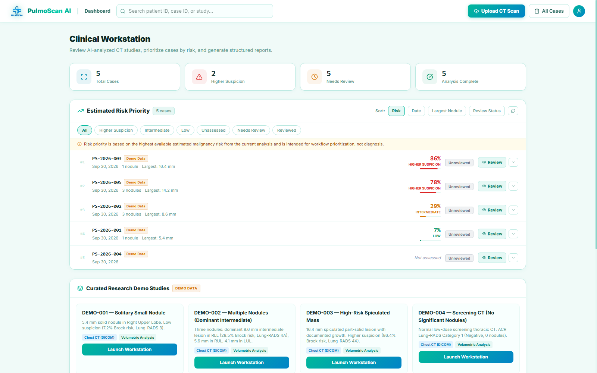
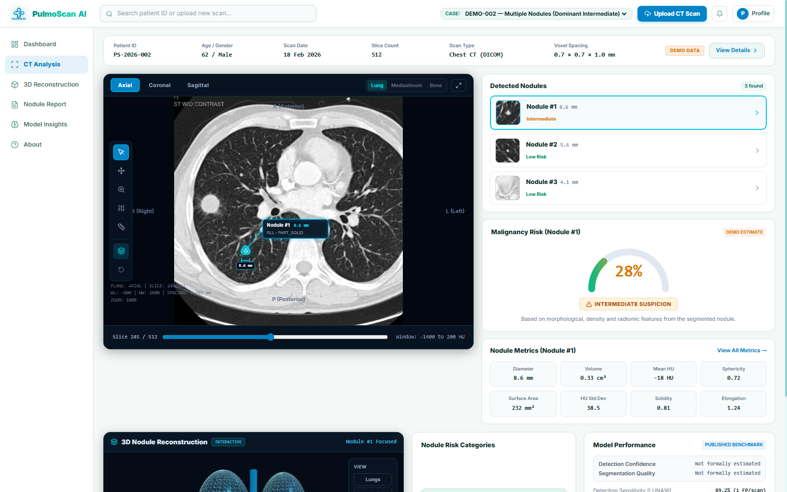
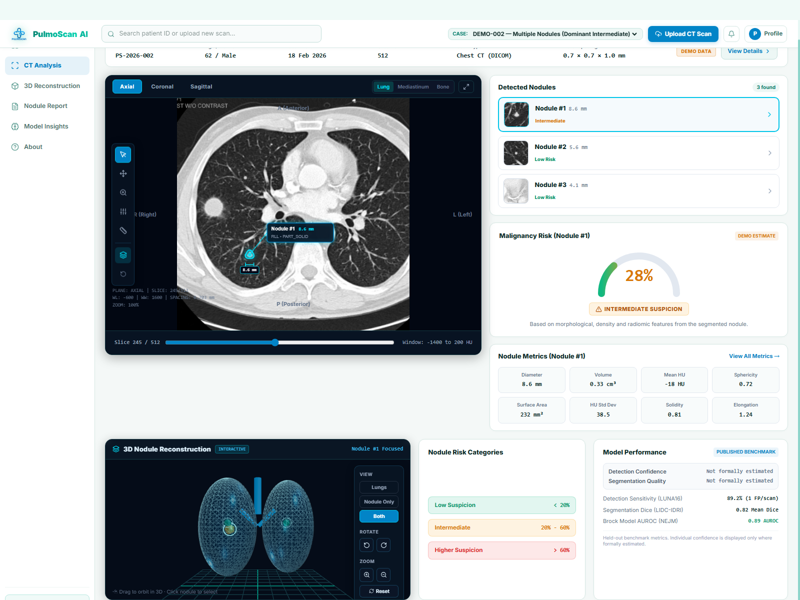
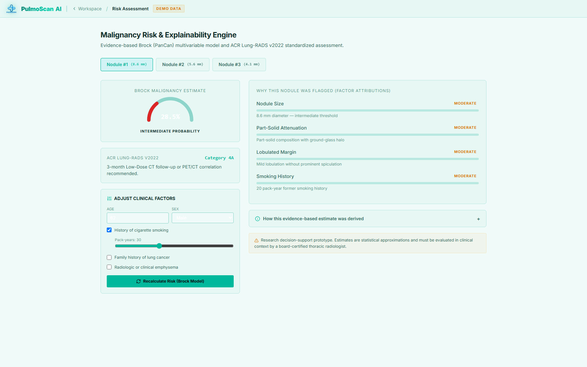
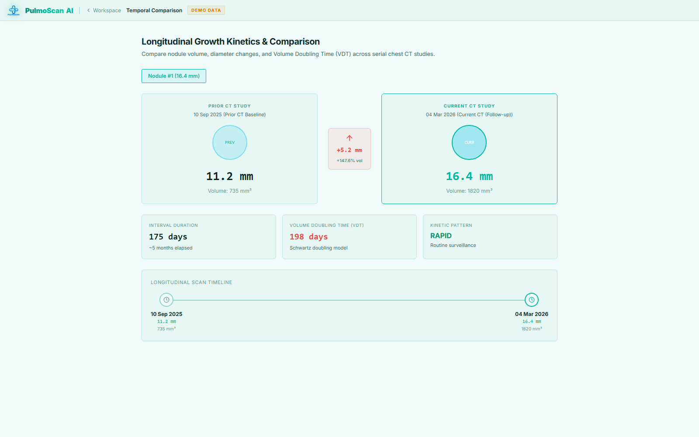

# PulmoScan AI

**AI-Assisted 3D Pulmonary Nodule Detection, Segmentation & Malignancy Risk Assessment Workstation**

> **RESEARCH & DECISION-SUPPORT PROTOTYPE ONLY**  
> *PulmoScan AI is an investigational research prototype developed for decision-support and demonstration. It is NOT cleared by regulatory authorities as a primary diagnostic medical device. It does NOT diagnose or guarantee malignancy; all findings, measurements, and risk estimates must be reviewed and verified by a licensed thoracic radiologist.*

---

## Project Status

| Metric | Status |
| --- | --- |
| **Status** | Experimental research/academic prototype |
| **Deployment** | Local workstation |
| **Clinical Status** | Not a diagnostic medical device — requires licensed specialist review |
| **Model Weights** | Optional / not included in repository (local cache or algorithmic fallback) |
| **Demo Data** | Synthetic / de-identified |
| **Cloud AI** | Optional Google Gemini integration (narrative assistance only; non-numeric) |

---

## Screenshots

The following screenshots are captured directly from the running workstation using the synthetic research demo studies:

### 1. Clinical Workstation Dashboard

*Risk-prioritized queue displaying synthetic demo cases with Brock risk scores, nodule counts, and review status.*

### 2. Multi-Planar CT Workstation

*Orthogonal multi-planar CT viewer (Axial, Coronal, Sagittal) with lung windowing, nodule detection overlays, calibrated measurements, and morphological metrics.*

### 3. Interactive 3D Lesion Reconstruction

*Interactive 3D thoracic and nodule anatomical localization viewer showing lesion coordinates within the lung parenchyma.*

### 4. Brock Malignancy Risk Engine & Explainability

*Published Brock / PanCan multivariable logistic regression risk engine, ACR Lung-RADS v2022 category, factor attributions, and interactive clinical adjuster.*

### 5. Longitudinal Comparison & Growth Kinetics

*Side-by-side serial CT comparison with Schwartz Volume Doubling Time (VDT) calculation and kinetic growth categorization.*

---

## 1. Problem Statement

> **"Pulmonary Nodule Risk Assessment:** AI that detects and segments lung nodules in 3D CT scans, measures morphology and density, and estimates malignancy risk."

PulmoScan AI addresses this by providing an integrated, radiology workflow-oriented workstation experience that mirrors the complete clinical imaging workflow:
$$\text{CT / DICOM} \longrightarrow \text{3D Preprocessing} \longrightarrow \text{Detection} \longrightarrow \text{Segmentation} \longrightarrow \text{Morphology \& Density} \longrightarrow \text{Risk Assessment} \longrightarrow \text{Temporal Growth} \longrightarrow \text{Radiology Report}$$

---

## 2. Key Features

- **Clinical Multi-Planar CT Viewer**:
  - Interactive multi-slice viewing across **Axial**, **Coronal**, and **Sagittal** orthogonal planes.
  - Multi-window clinical presets:
    - **Lung Window**: WL -600, WW 1500 (alveolar parenchyma & bronchovascular branches)
    - **Mediastinum / Soft Tissue**: WL 40, WW 350 (cardiac silhouette, adenopathy, chest wall)
    - **Bone Window**: WL 400, WW 1800 (cortical ribs and thoracic vertebrae)
  - Interactive tools: Caliper distance measurement ($mm = \text{pixels} \times \text{spacing}$), pan, zoom, reset, crosshairs.
  - Overlays: Detection bounding circles/boxes and 2D/3D segmentation contour masks.
  - Quick jump buttons to automatically center the viewer on detected nodule centroids.
- **Voxel-Level 3D Segmentation**:
  - Boundary extraction and 24-point planar contour polygons synchronized to slice depth.
- **Quantitative Morphological & Density Analysis**:
  - Maximum, minimum, and mean diameters (mm), 3D volume (mm³).
  - Sphericity ($\Psi$), elongation, compactness, surface area (mm²).
  - Margin classification: smooth, lobulated, irregular, spiculated.
  - Full Hounsfield Unit (HU) statistics (Mean, Median, Min, Max, Std Dev).
  - Density classification: solid, part-solid, ground-glass, calcified.
  - Anatomical lobe localization: Right Upper (RUL), Right Middle (RML), Right Lower (RLL), Left Upper (LUL), Left Lower (LLL).
- **Evidence-Based Malignancy Risk & Explainability**:
  - Implements the published **Brock / PanCan multivariable logistic regression model** (McWilliams et al., NEJM 2013).
  - Standardized **ACR Lung-RADS v2022** classification (Categories 1, 2, 3, 4A, 4B, 4X) with actionable clinical management recommendations.
  - Explainable AI breakdown displaying relative factor attributions (Size, Upper Lobe, Density, Spiculation, Age, Smoking history, Emphysema).
  - **Interactive Clinical Factors Adjuster**: Allows clinicians to enter or update patient age, sex, smoking pack-years, family history, and emphysema to recalculate risk in real-time.
- **Longitudinal Temporal Comparison & Growth Kinetics**:
  - Compares baseline vs. follow-up CT studies.
  - Calculates Volume Doubling Time (VDT in days) via the Schwartz formula:
    $$VDT = \frac{\Delta t \cdot \ln(2)}{\ln(V_2 / V_1)}$$
  - Categorizes kinetic growth pattern: Rapid ($VDT < 400$ days), Intermediate ($400 \le VDT \le 600$ days), or Indolent/Stable ($VDT > 600$ days).
  - Side-by-side prior vs current slice view with serial timeline progression.
- **Human-in-the-Loop "Correct AI" Feature**:
  - Allows radiologists to adjust diameters, margin types, or density classifications to capture expert corrections.
- **Structured Radiology Report & PDF Export**:
  - Comprehensive clinical report following standard thoracic radiology formatting.
  - Instant vector PDF generation via ReportLab with study info, quantitative table, Lung-RADS recommendations, and disclaimer.
- **Turnkey Demo Suite**:
  - **DEMO-001**: Screening CT — Solitary 5.4 mm solid nodule in LLL (Lung-RADS 3).
  - **DEMO-002**: Dominant 8.6 mm intermediate part-solid lesion in RLL with satellite nodules (Lung-RADS 4A).
  - **DEMO-003**: 16.4 mm high-risk spiculated part-solid lesion in RUL with documented temporal growth (VDT 198 days, Lung-RADS 4X).
  - **DEMO-004**: Screening CT — No significant nodules (ACR Lung-RADS Category 1 Negative).
  - **DEMO-005**: Multiple nodules of mixed suspicion featuring dominant 14.2 mm RUL lesion (Lung-RADS 4B).

---

## 3. Implementation Status & Model Weight Policy

The repository strictly separates the active algorithmic and software implementation from external neural weights:

### Current Implementation (Included & Fully Functional)
- **DICOM / NIfTI Ingestion:** Full metadata parsing, modality check, and geometric validation via Pydicom.
- **CT Preprocessing:** Conversion to Hounsfield Units, canonical LPS/RAS reorientation, target resampling ($0.703 \times 0.703 \times 1.25$ mm), and lung window normalization.
- **Multi-Planar Reconstruction (MPR):** Real-time orthogonal slicing across Axial, Coronal, and Sagittal planes.
- **Candidate Detection Fallback:** Algorithmic 3D candidate nodule filtering and ROI localization.
- **Deterministic 3D Segmentation:** Voxel-level 3D adaptive thresholding and planar boundary contour extraction via `skimage.measure.find_contours`.
- **Quantitative Morphological & HU Analytics:** True volume, diameter, sphericity, compactness, and HU statistics.
- **Brock / PanCan Risk Engine:** Exact mathematical implementation of the NEJM 2013 logistic regression formula.
- **ACR Lung-RADS v2022 Logic:** Deterministic category assignment (1 through 4X) and clinical recommendations.
- **Longitudinal Growth Kinetics:** Schwartz Volume Doubling Time (VDT) calculations and prior vs current comparison.
- **Human-in-the-Loop Corrections:** Radiologist override capabilities for findings.
- **Structured Reporting:** PDF vector export via ReportLab.
- **Optional Gemini Narrative Assistance:** Grounded narrative summaries when a `GEMINI_API_KEY` is provided; never alters numeric calculations.

### Optional External Model Integration (Weights Not Bundled)
- **MONAI 3D RetinaNet Checkpoint (`lung_nodule_ct_detection`):** The repository provides modular interfaces to load local PyTorch/MONAI weights if placed in `MODEL_DIR`. Trained checkpoint files (`.pt`) are **not bundled** in this repository.
- **MONAI 3D Segmentation Checkpoint (UNETR / 3D U-Net):** Can be placed in `MODEL_DIR/nodule_segmentation/model.pt` for neural inference; in their absence, the system automatically runs the deterministic 3D morphological segmentation fallback.
- **Benchmark Performance Clarity:** The referenced MONAI/LUNA16 sensitivity figure (~94.2% at 1.0 FPs/scan) is a **PUBLISHED EXTERNAL BENCHMARK** from the LUNA16 challenge and should not be interpreted as Synapse's own measured performance or internal validation.

---

## 4. Architecture

```text
                                  Browser (Client)
                                         │
                   ┌─────────────────────┴─────────────────────┐
                   ▼                                           ▼
      Next.js 16 + React 19 Frontend            FastAPI Python Backend (:8000)
      • Dark Radiology Workstation              • REST API Endpoints
      • HTML5 Canvas Slice Viewer               • DICOM / NIfTI Ingestion
      • Window/Level Presets                    • Multi-Planar Slice Renderer
      • MPR Controls (Axial/Cor/Sag)            • Asynchronous Background Jobs
      • Interactive Caliper & Masks             • ReportLab PDF Engine
                   │                                           │
                   └─────────────────────┬─────────────────────┘
                                         ▼
                                AI & Analytics Core
                   • ConcreteNoduleDetector (Candidate Centroids & BBoxes)
                   • ConcreteNoduleSegmenter (3D Contours & Voxel Masks)
                   • ConcreteFeatureExtractor (HU Stats, Morphology, Lobes)
                   • ConcreteRiskEngine (Brock Model & ACR Lung-RADS v2022)
                   • TemporalService (Volume Doubling Time & Kinetics)
                                         │
                                         ▼
                                Database & Storage
                   • SQLite / PostgreSQL via SQLAlchemy ORM
                   • Uploaded DICOM Series & NIfTI Volumes
```

---

## 5. Folder Structure

```text
Synapse/
├── README.md                       # Comprehensive documentation & project overview
├── LICENSE                         # MIT License for original implementation
├── SECURITY.md                     # Security policy, PHI guidelines, and vulnerability reporting
├── THIRD_PARTY_NOTICES.md          # Third-party attribution, model, benchmark, and literature notices
├── docs/                           # Technical documentation & screenshots
│   ├── architecture.md             # System architecture & data flow
│   ├── ai_pipeline.md              # Pipeline stages & modular interfaces
│   ├── models.md                   # External model benchmarks & mathematical specifications
│   ├── privacy.md                  # Privacy, local storage boundaries, and cloud data handling
│   └── screenshots/                # Real application UI captures (synthetic demo data)
│       ├── dashboard.png
│       ├── ct-workstation.png
│       ├── three-d-view.png
│       ├── risk-assessment.png
│       └── report-or-comparison.png
├── backend/
│   ├── app/
│   │   ├── ai/                     # AI Pipeline interfaces & implementations
│   │   │   ├── pipeline.py         # Abstract interfaces (Detector, Segmenter, Risk, etc.)
│   │   │   ├── detector.py         # Concrete 3D candidate detector (optional MONAI weights)
│   │   │   ├── segmenter.py        # Concrete 3D segmenter & contour generator (real/fallback)
│   │   │   ├── feature_extractor.py# Quantitative morphology & HU analytics
│   │   │   ├── risk_engine.py      # Brock PanCan model & ACR Lung-RADS
│   │   │   └── demo_service.py     # Isolated structured demo datasets
│   │   ├── api/
│   │   │   └── routes/
│   │   │       ├── cases.py        # Cases, upload, slices, risk, temporal, report
│   │   │       └── health.py       # Health check
│   │   ├── core/
│   │   │   ├── config.py           # App settings & CORS
│   │   │   └── database.py         # SQLAlchemy engine & session factory
│   │   ├── models/
│   │   │   └── case.py             # ORM models (Case, ScanMetadata, Nodule, Risk, Report)
│   │   ├── schemas/
│   │   │   └── case.py             # Pydantic request/response schemas
│   │   ├── services/
│   │   │   ├── case_service.py     # Case business logic & background jobs
│   │   │   ├── dicom_service.py    # Pydicom/NIfTI metadata extraction & QC
│   │   │   ├── ct_renderer.py      # Multi-planar slice rendering with WL/WW
│   │   │   ├── temporal_service.py # Longitudinal growth & VDT calculation
│   │   │   └── report_service.py   # Report generation & ReportLab PDF export
│   │   └── main.py                 # FastAPI application root
│   ├── seed_demo.py                # Database seeder for demo cases
│   ├── test_full_suite.py          # End-to-end automated test suite
│   ├── requirements.txt
│   └── pulmoscan.db                # generated locally by seed_demo.py; not tracked
└── frontend/
    ├── app/
    │   ├── page.tsx                # Professional landing page
    │   ├── analyze/page.tsx        # CT Upload & demo case selector
    │   ├── processing/[caseId]/    # Asynchronous pipeline progress polling
    │   ├── workspace/[caseId]/     # Central CT Workstation with viewer & findings
    │   ├── risk/[caseId]/page.tsx  # Brock risk assessment & explainability
    │   ├── compare/[caseId]/       # Longitudinal growth & VDT kinetics
    │   ├── report/[caseId]/        # Radiology report & PDF download
    │   └── cases/page.tsx          # Case history & status management
    ├── components/
    │   ├── MedicalCTViewer.tsx     # Canvas multi-slice viewer (MPR, WL/WW, calipers)
    │   └── ThreeDReconstructionViewer.tsx # 3D nodule anatomical localization
    ├── lib/
    │   ├── api.ts                  # Typed client for FastAPI backend
    │   └── demoCases.ts            # Single authoritative source of truth for demo cases
    └── types/
        └── api.ts                  # Shared TypeScript interfaces
```

---

## 6. Getting Started & Local Setup

### Prerequisites
- Python 3.10+
- Node.js 18+ and npm

### Backend Setup
1. Open a terminal in the `backend/` directory:
   ```bash
   cd backend
   pip install -r requirements.txt
   ```
2. Seed the database with demo cases:
   ```bash
   python seed_demo.py
   ```
3. Start the FastAPI server:
   ```bash
   python -m uvicorn app.main:app --host 127.0.0.1 --port 8000 --reload
   ```
   API interactive docs will be available at `http://127.0.0.1:8000/api/docs`.

### Frontend Setup
1. In a separate terminal, navigate to `frontend/`:
   ```bash
   cd frontend
   npm install
   ```
2. Start the Next.js dev server:
   ```bash
   npm run dev -- -p 3000
   ```
3. Open your browser at `http://localhost:3000`.

---

## 7. Automated Test Suite

The backend includes an end-to-end automated test suite (`backend/test_full_suite.py`) designed to verify the complete processing lifecycle:

```bash
cd backend
python test_full_suite.py
```

The test scripts cover:
1. Health check & configuration
2. Demo cases retrieval
3. Case history querying
4. Analysis results validation
5. Multi-planar slice rendering (Axial, Coronal, Sagittal)
6. 2D/3D segmentation contour extraction
7. Dynamic Brock risk recalculation with clinical inputs
8. Temporal growth & Volume Doubling Time (VDT)
9. Expert nodule adjustment ("Correct AI")
10. Structured report generation and PDF binary export

*(Note: In environments where Python is not installed in the host shell, frontend verification runs via `npm run lint`, `npx tsc --noEmit`, and `npm run build`.)*

---

## 8. Future Model Integration Roadmap

The codebase isolates model inference using standard abstract interfaces (`backend/app/ai/pipeline.py`):
1. **NoduleDetector**: Plug in MONAI's pretrained 3D RetinaNet (`lung_nodule_ct_detection`) trained on LUNA16.
2. **NoduleSegmenter**: Plug in MONAI UNETR or Swin UNETR fine-tuned on LIDC-IDRI thoracic nodule masks.
3. **Cornerstone3D**: The `MedicalCTViewer.tsx` component is structured to allow dropping in Cornerstone3D / OHIF DICOMweb loaders without redesigning the UI layout.

---

## 9. Research Disclaimer

*PulmoScan AI is a research and decision-support prototype. It is NOT a cleared diagnostic medical device. It does not replace clinical judgment, thoracic biopsy, or radiological interpretation by certified medical specialists.*
